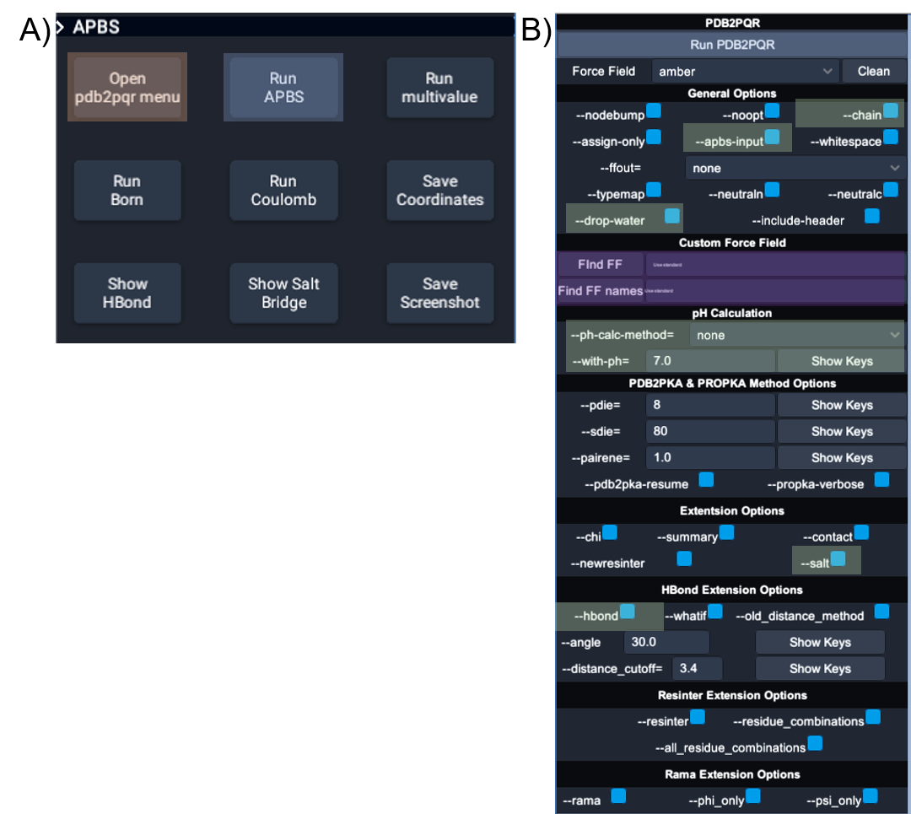
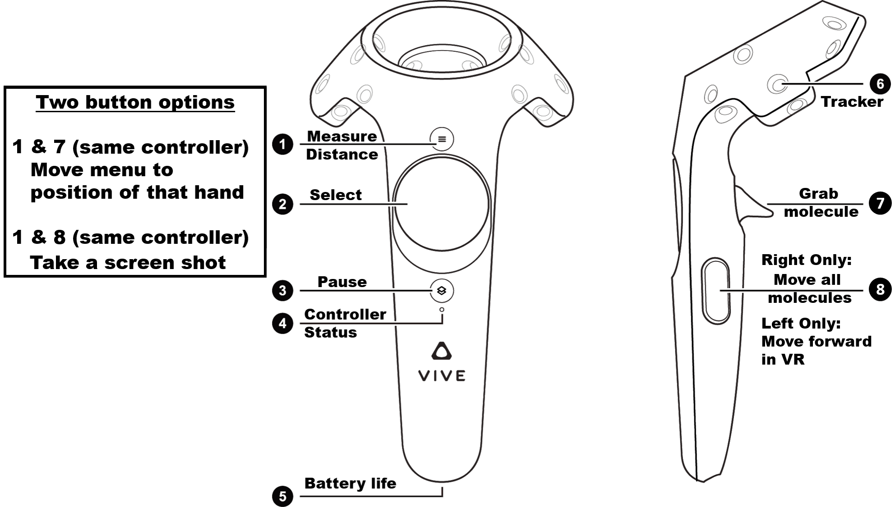
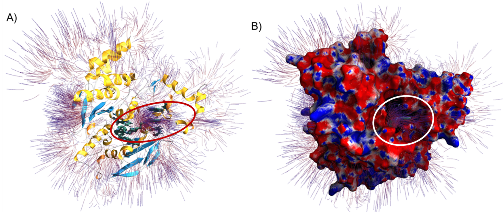
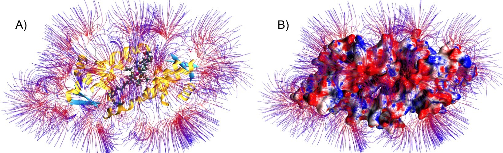

# Biomolecular electrostatics in virtual reality

Biomolecular electrostatic properties calculated by [APBS/PDB2PQR](http://www.poissonboltzmann.org/) can be visualized in two dimensions using a variety of platforms, including [VMD](https://www.ks.uiuc.edu/Research/vmd/), [PyMOL](https://pymol.org/), and [Chimera](https://www.cgl.ucsf.edu/chimera/).
Through collaboration with the [Baaden research group](http://www.baaden.ibpc.fr/), it is now possible to visualize electrostatics in their more natural three-dimensional environment through virtual reality (VR).
The new UnityMol-APBS software integrates [APBS/PDB2PQR](http://www.poissonboltzmann.org/) functionality with the UnityMol VR visualization framework. 
The VR version of this software is freely available for the Windows platform.
Desktop two-dimensional visualization with this software is possible on Windows, Mac OS X, or Linux.

The major features of the software are described in [a recent publication](https://arxiv.org/abs/1908.11261).
Examples of UnityMol-APBS VR visualization are provided below and in the following videos:

* [Visualization of electrostatic steering of acetylcholinesterase (AChE) ligands](https://www.youtube.com/watch?v=-SfzQ97h4O0)
* [Exploration of the electrostatic properties of a synthetic redox protein](https://www.youtube.com/watch?v=5J8qq7r_gos)

## Obtaining UnityMol-APBS

As with APBS and PDB2PQR, we request that you [register your use of the software](http://eepurl.com/by4eQr) to help with its continued development through federal funding (NIH grant GM69702).

Due to limitations on virtual reality hardware/software support, UnityMol-APBS is currently only available on Windows.
This software can be downloaded from https://github.com/Electrostatics/VR/releases.

## Using UnityMol-APBS

This documentation assumes that UnityMol-APBS has been downloaded from the link above and that [APBS/PDB2PQR](http://www.poissonboltzmann.org/) has been installed at `C:\APBS-PDB2PQR`.

### User environment

The figure above illustrates the UnityMol-APBS user interface for PDB2PQR and APBS. (A) The main UnityMolAPBS menu; orange box highlights the two buttons used to open the APBS and PDB2PQR tools. (B) The main menu for interactions with APBS and PDB2PQR. Blue boxes show the
buttons to launch PDB2PQR and APBS executables, green boxes show the location of the options used for producing the image in Figures 2, and the purple boxes highlight the two input fields required to use custom force fields and custom residue names.

The figure above illustrates UnityMol-APBS menu commands for HTC Vive controllers.

### Visualization of electrostatic steering of acetylcholinesterase (AChE) ligands

Please see YouTube for a [video](https://www.youtube.com/watch?v=-SfzQ97h4O0) illustrating this example.

As described in [a recent publication](https://arxiv.org/abs/1908.11261), UnityMol-APBS has been used to visualize the electrostatic steering of ligands to the AChE catalytic site.
The input files required for this example are provided [in this repository](examples/AChE/).
The directions for executing this example are provided in the [accompanying paper](https://arxiv.org/abs/1908.11261).

### Exploration of the electrostatic properties of a synthetic redox protein

Please see YouTube for a [video](https://www.youtube.com/watch?v=5J8qq7r_gos) illustrating this example.

As described in [a recent publication](https://arxiv.org/abs/1908.11261), UnityMol-APBS has been used to visualize the electrostatic properties of a redox site in an engineered version of the LmrR protein system.
The input files required for this example are provided [in this repository](examples/LmrR/).
The directions for executing this example are provided in the [accompanying paper](https://arxiv.org/abs/1908.11261).

